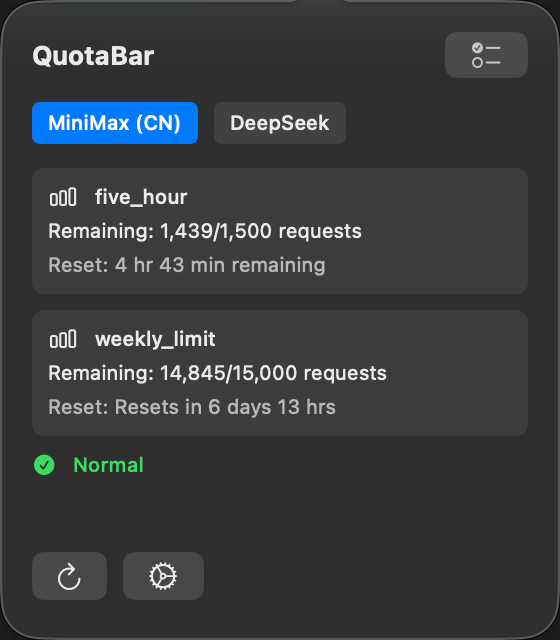
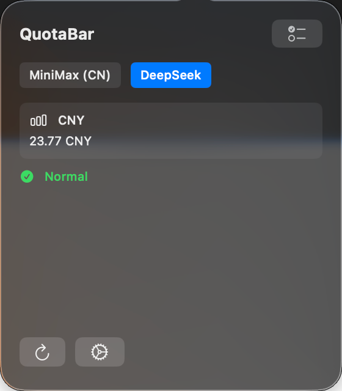
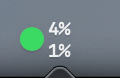

# QuotaBar

English | [中文](./README_zh.md)

A macOS menu bar app for viewing multiple AI platform API usage (MiniMax, GLM, DeepSeek, Kimi).

## Features

- Multi-platform support: MiniMax, GLM, DeepSeek, Kimi
- Real-time daily/weekly usage percentage in menu bar
- Dynamic icon color indicating usage status
  - Green: remaining ≥ 50%
  - Yellow: remaining 10% ~ 50%
  - Red: remaining < 10%
- Left-click to open details popover
- Right-click context menu for quick actions
- API Token configuration and management
- Sparkle auto-update support

## Screenshots

## Requirements

- macOS 14.0 or later

## Installation

1. Download the latest `.dmg` from [Releases](https://github.com/nmsn/quota-bar/releases)
2. Double-click to open the DMG
3. Drag `QuotaBar` into the Applications folder
4. On first run, right-click the app and select "Open"

## Usage

1. Click the menu bar icon after launching
2. Click the button in the top-right corner to configure API Token
3. Select a platform and paste the Token
4. The menu bar will display usage statistics in real-time

## License

MIT