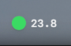

# QuotaBar

[English](./README.md) | 中文

macOS 菜单栏应用，支持多平台 API 使用量查看（MiniMax、GLM、DeepSeek、Kimi）。

## 功能

- 多平台支持：MiniMax、GLM、DeepSeek、Kimi
- 实时显示日/周使用量百分比
- 动态图标颜色指示使用状态
  - 绿色：剩余 ≥ 50%
  - 黄色：剩余 10% ~ 50%
  - 红色：剩余 < 10%
- 左键点击打开详情 popover
- 右键菜单快速操作
- API Token 配置与管理
- Sparkle 自动更新支持

## 截图

## 系统要求

- macOS 14.0 或更高版本
- 应用体积：约 3.8 MB（DMG 安装包：约 1.4 MB）
- 内存占用：约 30-50 MB

## 安装

1. 从 [Releases](https://github.com/nmsn/quota-bar/releases) 下载最新版本 `.dmg` 文件
2. 双击打开 DMG
3. 将 `QuotaBar` 拖入 Applications 文件夹
4. 首次运行时，右键点击应用选择"打开"

## 使用

1. 首次打开后，点击菜单栏图标
2. 在弹出窗口中点击右上角按钮配置 API Token
3. 选择平台并粘贴 Token
4. 菜单栏将实时显示使用量

## License

MIT &middot; 欢迎提交 PR！期待添加更多 AI 平台支持。

## 贡献指南

想要添加新的 AI 平台支持？请查阅我们的 [API 参考文档](docs/platform-api-reference.md)，欢迎提交 PR！